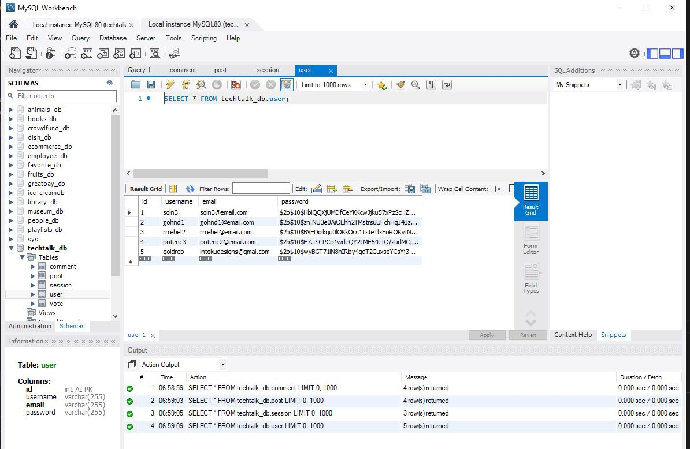
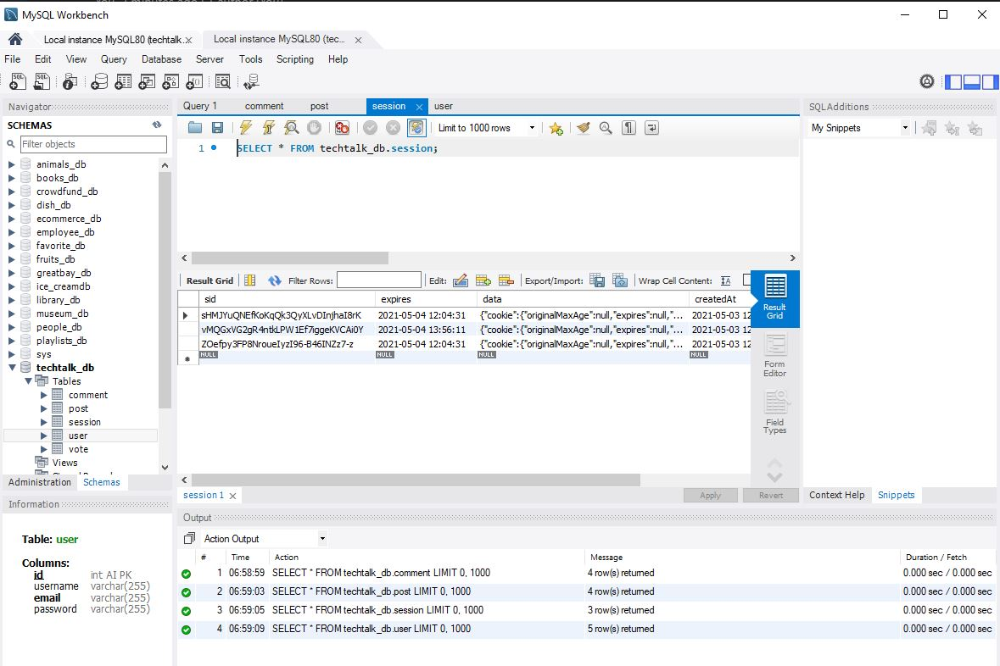
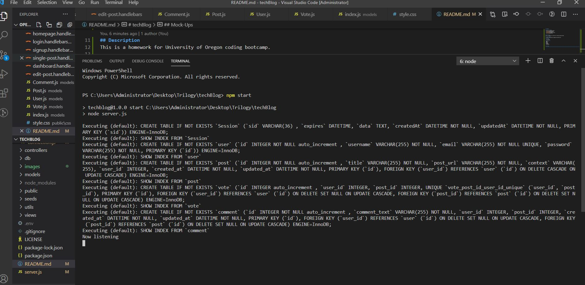
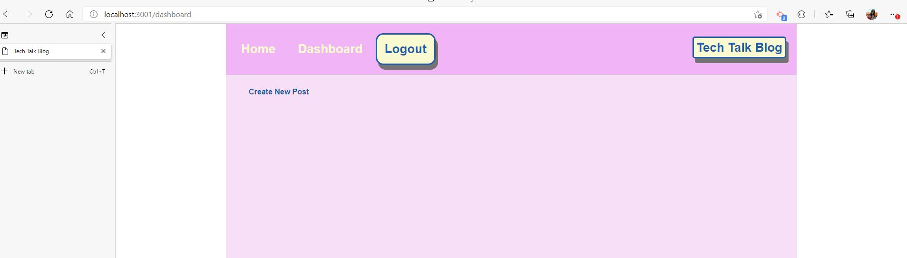
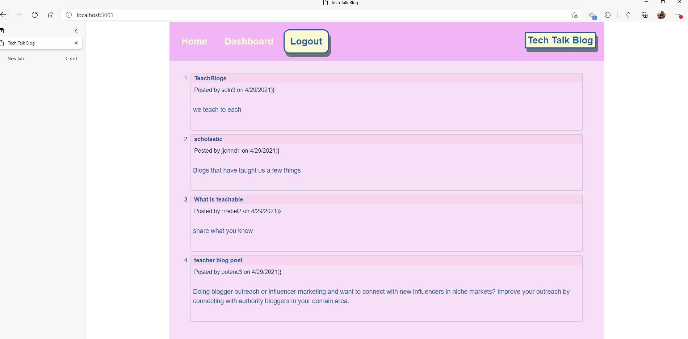

# techBlog

## Table of Contents

- [Description](#Description)
- [License](#License-Badge)
- [Packages](#Packages)
- [Technologies](#Technologies)
- [Mock-Ups](#Mock-Ups)

## Description

This is a homework for University of Oregon coding bootcamp.

## License-Badge

## Packages

- npm packages

## Technologies

- Node.js
- NPM
- MySql
- Heroku
- Express
- handlebars

## Mock-Ups

MySql Database is seeded

MySql Cookies stored

npm start to run the server

localhost login

localhost dashboard

localhost blog seeds

